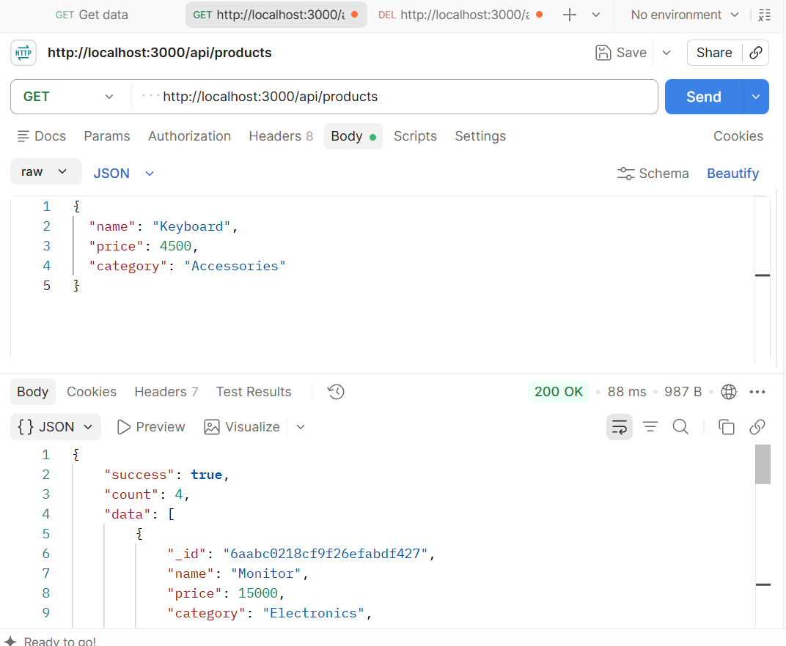
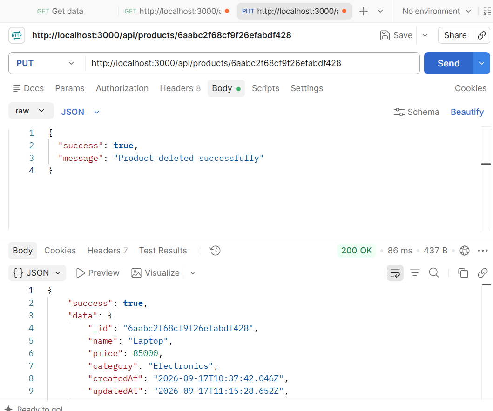
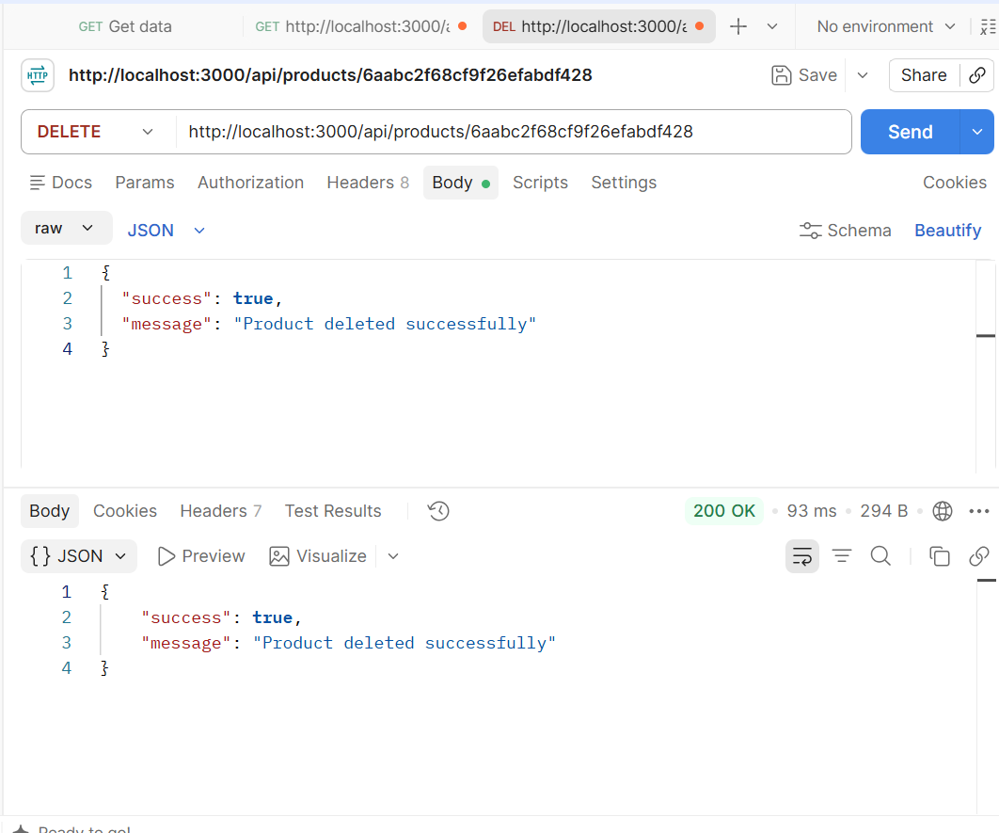

# Simple REST API — Product List

A simple RESTful API built with **Node.js**, **Express**, and **MongoDB (Mongoose)** to manage a product list. Supports Create, Read (list & single), Update, and Delete operations, all responses in JSON format.

## 🛠️ Tech Stack

- Node.js
- Express.js
- MongoDB Atlas
- Mongoose

## 📁 Project Structure

WD_1_SimpleRESTAPI_BYTE/
├── controllers/
│ └── productController.js
├── models/
│ └── Product.js
├── routes/
│ └── productRoutes.js
├── middleware/
│ └── errorHandler.js
├── .env
├── .gitignore
├── server.js
├── package.json
└── README.md


## ⚙️ Setup Instructions

1. Clone the repository:
```bash
   git clone <https://github.com/hadiazia0328-lab/Product-rest-api.git>
   cd WD_1_SimpleRESTAPI_BYTE
```

2. Install dependencies:
```bash
   npm install
```

3. Create a `.env` file in the root directory with the following:
```env
   MONGODB_URI=your_mongodb_connection_string
   PORT=3000
```

4. Start the server:
```bash
   node server.js
```

5. Server will run on `http://localhost:3000`

## 📋 API Endpoints

| Method | Endpoint              | Description              |
|--------|------------------------|---------------------------|
| GET    | `/api/products`        | Get all products          |
| GET    | `/api/products/:id`    | Get a single product by ID|
| POST   | `/api/products`        | Create a new product      |
| PUT    | `/api/products/:id`    | Update a product by ID    |
| DELETE | `/api/products/:id`    | Delete a product by ID    |

## 📌 Sample Requests & Responses

### 1. Create a Product — `POST /api/products`

**cURL:**
```bash
curl -X POST http://localhost:3000/api/products \
  -H "Content-Type: application/json" \
  -d '{"name": "Monitor", "price": 15000, "category": "Electronics"}'
```

**Response (201 Created):**
```json
{
  "success": true,
  "data": {
    "_id": "6aabc0218cf9f26efabdf427",
    "name": "Monitor",
    "price": 15000,
    "category": "Electronics",
    "createdAt": "2026-09-17T10:25:37.691Z",
    "updatedAt": "2026-09-17T10:25:37.691Z"
  }
}
```

### 2. Get All Products — `GET /api/products`

**cURL:**
```bash
curl http://localhost:3000/api/products
```

**Response (200 OK):**
```json
{
  "success": true,
  "count": 4,
  "data": [ /* array of product objects */ ]
}
```

### 3. Get Single Product — `GET /api/products/:id`

**cURL:**
```bash
curl http://localhost:3000/api/products/6aabc0218cf9f26efabdf427
```

**Response (200 OK):**
```json
{
  "success": true,
  "data": {
    "_id": "6aabc0218cf9f26efabdf427",
    "name": "Monitor",
    "price": 15000,
    "category": "Electronics"
  }
}
```

### 4. Update a Product — `PUT /api/products/:id`

**cURL:**
```bash
curl -X PUT http://localhost:3000/api/products/6aabc0218cf9f26efabdf427 \
  -H "Content-Type: application/json" \
  -d '{"price": 18000}'
```

**Response (200 OK):**
```json
{
  "success": true,
  "data": {
    "_id": "6aabc0218cf9f26efabdf427",
    "name": "Monitor",
    "price": 18000,
    "category": "Electronics"
  }
}
```

### 5. Delete a Product — `DELETE /api/products/:id`

**cURL:**
```bash
curl -X DELETE http://localhost:3000/api/products/6aabc0218cf9f26efabdf427
```

**Response (200 OK):**
```json
{
  "success": true,
  "message": "Product deleted successfully"
}
```


## ⚠️ Error Responses

| Status Code | Meaning                          |
|-------------|-----------------------------------|
| 400         | Bad Request (missing required fields) |
| 404         | Product not found                 |
| 500         | Internal Server Error             |

**Example (404):**
```json
{
  "success": false,
  "message": "Product not found"
}
```

## 📸 Postman Test Screenshots

### Get All Products


### Update a Product


### Delete a Product


## 👤 Author

**Hadia Zia**
